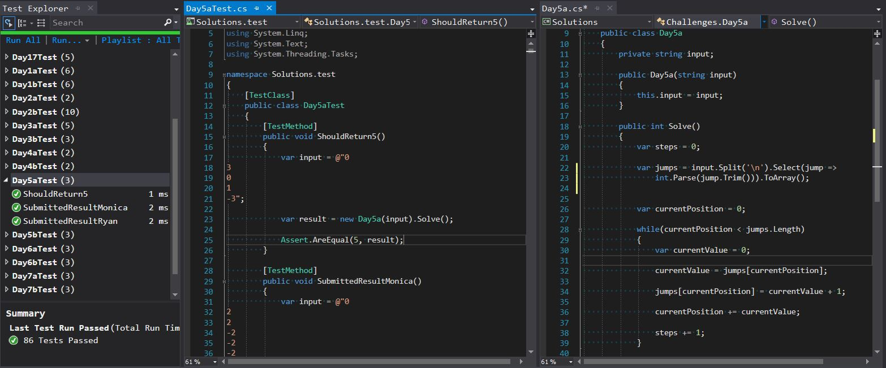

## Advent of Code 2017 Solutions

**Description:** Advent of Code is a series of small programming puzzles for a variety of skill levels. They are self-contained and are just as appropriate for an expert who wants to stay sharp as they are for a beginner who is just learning to code. Each puzzle calls upon different skills and has two parts that build on a theme.

**Rationale:** This repository is a collection of solutions for Advent of Code's 2017 puzzles.  I chose to complete the challenges using test driven development in order to get more experience with this method of programming.  I also pair programmed with my mentor to complete these challenges.  

**Extension:** I am still working through the Advent of Code challenges, and I hope to complete the entire 2017 series. 

**Example of Passing Test in Visual Studio:**

**Link to Advent of Code 2017 Challenges:** http://adventofcode.com/2017

**Pair Programmer:** Ryan Pardieck | https://github.com/ryanpardieck

**Contact Information:** Monica Marek | monicamarek24@gmail.com
